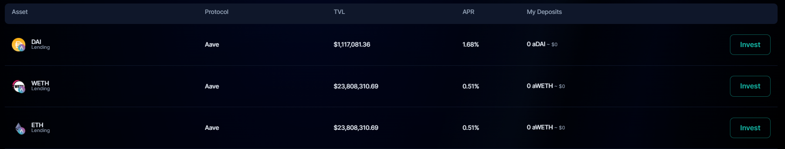
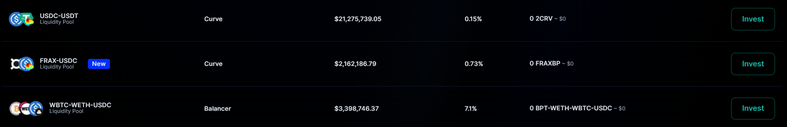

Sentiment is a permissionless undercollateralized borrowing protocol that allows users to get up
to 5x leveraged exposure to specific crypto assets and investment strategies. Sentiment
facilitates interactions between three types of users:

- [Borrowers](https://github.com) borrow against deposited collateral
- [Lenders](https://github.com) earn yield on otherwise idle assets
- [Controllers](https://github.com) monitor account balances and transactions to maintain the health of the
  protocol

Sentiment’s premier innovation that allows for undercollateralized loans is the [Account](https://github.com) contract.
Borrowers using Sentiment mint a unique contract that holds custody of both deposited and
borrowed assets. After depositing initial collateral, borrowers can swap, lend, and provide
liquidity to various liquidity pools across DeFi, all within the Sentiment interface.

For example: Borrower A deposits $10,000 in collateral into Sentiment. They can farm their
USDC collateral in Curve, borrow $20,000 ETH against that collateral, and then supply that ETH
in AAVE to earn additional interest. If the borrowed assets decrease in price, their position may
get liquidated (see [Liquidations](https://github.com))

## Why Sentiment

Current DeFi borrowing markets are limited and inefficient because they require users to
overcollateralize their borrowing. A user may only be able to borrow $80 against $100 of
collateral.

Overcollateralized lending exists to mitigate the risk of a protocol accumulating bad debt–when
the value of a borrower’s collateral becomes less than the value of borrowed assets. When this
happens, account liquidators are unable to sell the collateral, buy back the borrowed asset, and
pay back lenders without incurring a loss.

While the disintermediary nature of blockchain and DeFi markets creates a transparent financial
system, it introduces new challenges to overcome. Specific to borrowing markets as outlined
above, on-chain lenders are introduced to widespread counterparty risk, which makes it difficult
to build robust undercollateralized credit markets. This creates capital inefficiency that inhibits
many participants in the space, such as sophisticated money managers, structured products
that depend on (or could benefit from) leverage, and degen traders looking to optimize long-tail
opportunities

## Intro to Account Contract

Sentiment overcomes this challenge with the aforementioned [Account](https://github.com) feature, which is a proxy
contract created by the user that holds custody of assets. Borrowers can borrow up to five times
their collateral, and are liquidated once their collateral falls below a certain health limit set by
Sentiment.

This design allows borrowers to control all actions of their own Account while Sentiment is able
to monitor the health of the account. Account [Controllers](https://github.com) and [Maintainers](https://github.com) monitor every account
interaction delegated by the borrower before they are executed, and can liquidate user accounts
before the value of their account assets goes below the value of their collateral.
