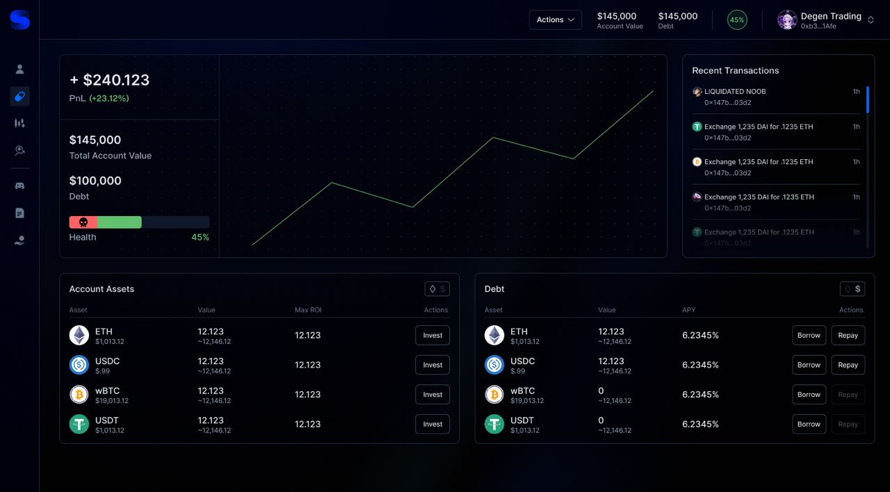

Sentiment’s Account feature is the core primitive that allows for undercollateralized lending via
on-chain [hypothecation](https://www.investopedia.com/terms/h/hypothecation.asp) of assets. Upon entering the Sentiment website and connecting a
wallet, users will be prompted to mint an Account. The minted Account will be a unique contract
that is separate from the borrower’s [EOA](https://ethereum.org/en/developers/docs/accounts/) and will hold both the deposited collateral and
borrowed assets. Account assets can be used solely at the discretion of the borrower, and are
placed in the proxy contract to ensure any transactions fall within Sentiment’s risk guidelines.
The minting is done by the Account Manager, which facilitates interactions between a
Borrower’s EOA and their Margin Account.

## Account Manager

The Account Manager contract is an important component of the Sentiment architecture, as it is
the bridge connecting borrowers to their Accounts. The Manager is a smart contract that has
three main responsibilities:

1. Minting and initializing accounts for borrowers
2. Managing the state of account balances and margin levels for the [Controller](../core-concepts/controller.md) and [Risk Engine](../core-concepts/risk-engine.md) addresses
3. Initiating withdrawals and transfers between the user, account, and lending pool

:::info

For a detailed graphic of the Account Manager’s interaction with the
borrower, please see the [Borrowing](../using-sentiment/borrowing.md) section.

:::

## Delegated Ownership

It is important to note that borrowers who have created an account will never have custody of
the loaned assets. This is a key distinction that allows Sentiment to maintain first right of
ownership of the account assets, ensuring account risk is in check at all times. As users interact
with the Account to borrow, withdraw, or deploy assets across external contracts, each
interaction's calldata will pass through the [Interaction Controllers](../core-concepts/controller.md) to determine both:

1. The type of transaction
2. The effect on account value

This level of monitoring ensures that all attempted transactions maintain protocol solvency and
mitigate potential credit risk to Sentiment lenders. The allow-list for Interaction Controllers is set
by Sentiment and subject to future change.

## Restrictions

Sentiment Account contracts are limited in the contracts they can interact with across DeFi,
which help maintain the safety of the debt pool in the protocol. The protocol can control what
contracts (and by extension tokens) the borrowed assets are allowed to interact with, and this
can be changed over time. In the future, more integrations will be added as we are able to test
and ensure timely liquidation if necessary. Keep up to date with future integrations on our blog
[here](https://blog.sentiment.xyz/).

## Example

Sentiment’s Account architecture allows borrowers to gain leveraged exposure to individual
assets like BTC and ETH, interest bearing assets like aETH (Aave ETH), and different liquidity
pools within Curve, Convex, and Balancer.

A user wanting leveraged exposure to the Curve TriCrypto pool (WBTC, WETH, USDT) could
take the following steps:

1. Mint a Sentiment Account
2. Deposit WETH from their EOA into the Sentiment Account
3. [Borrow](https://arbitrum.sentiment.xyz/borrow) USDT up to 5x leverage (20% margin) via the Borrow page
4. [Swap](https://arbitrum.sentiment.xyz/trade) into desired WBTC amount
5. Deposit the tokens into the Curve liquidity pool via the Sentiment [Invest](https://arbitrum.sentiment.xyz/invest) page

Account balances can be monitored by the borrower via the account tab or the upper right
corner of the interface. Here you can pay down debt, deposit new assets, or withdraw assets to
your EOA wallet.

